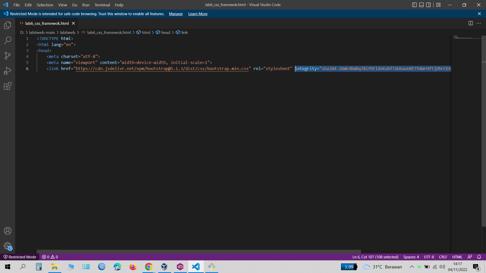
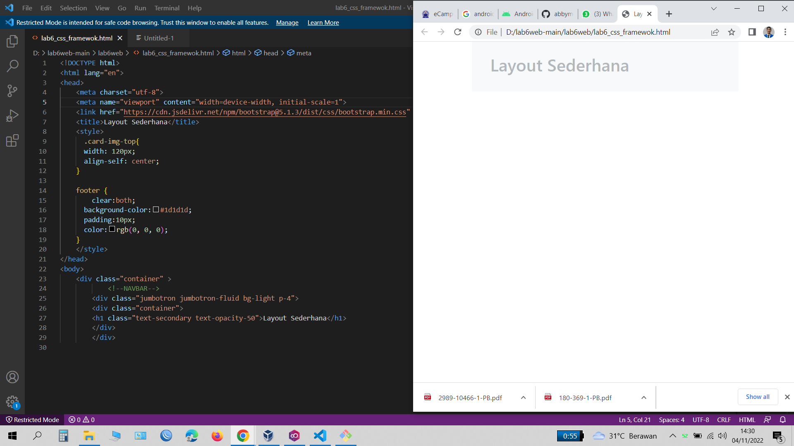
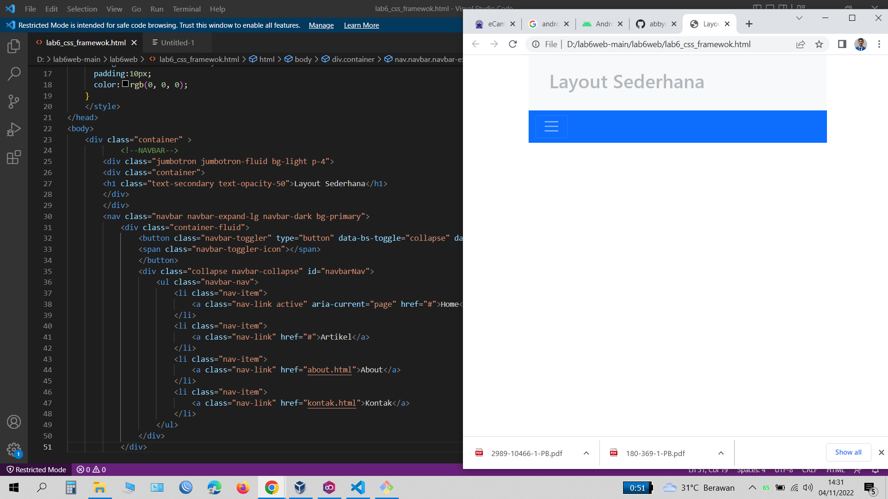
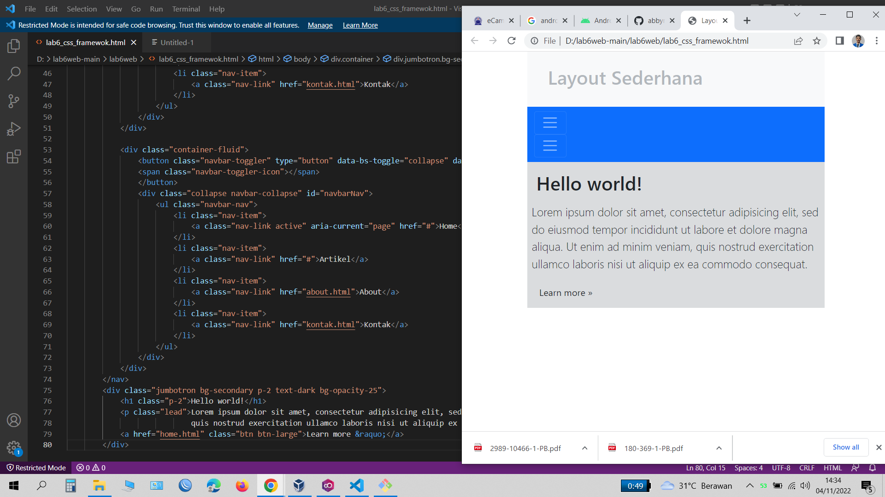
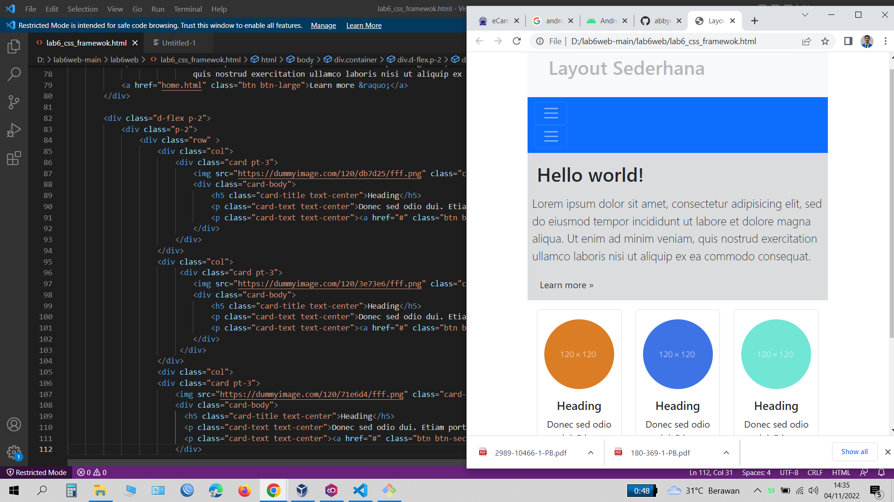
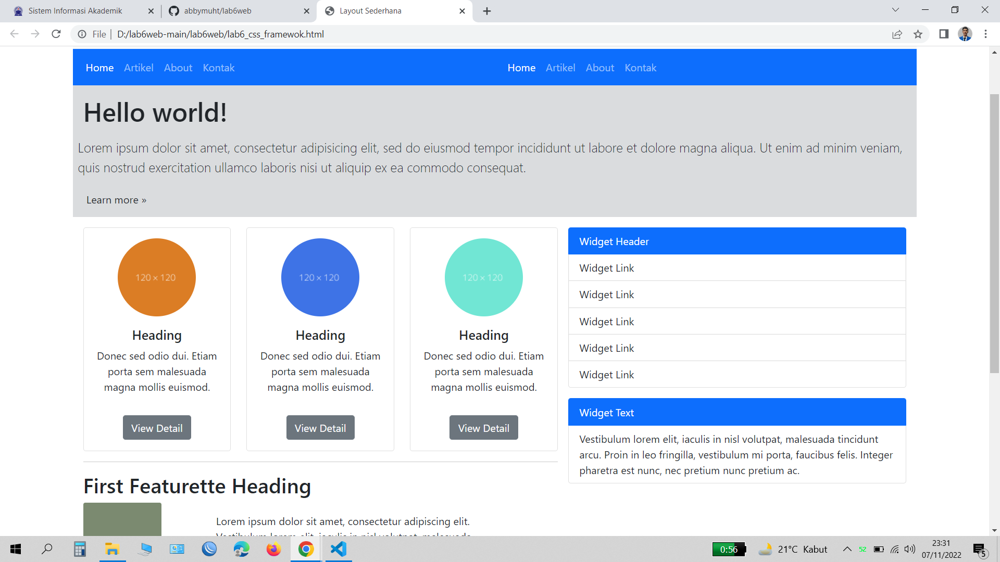
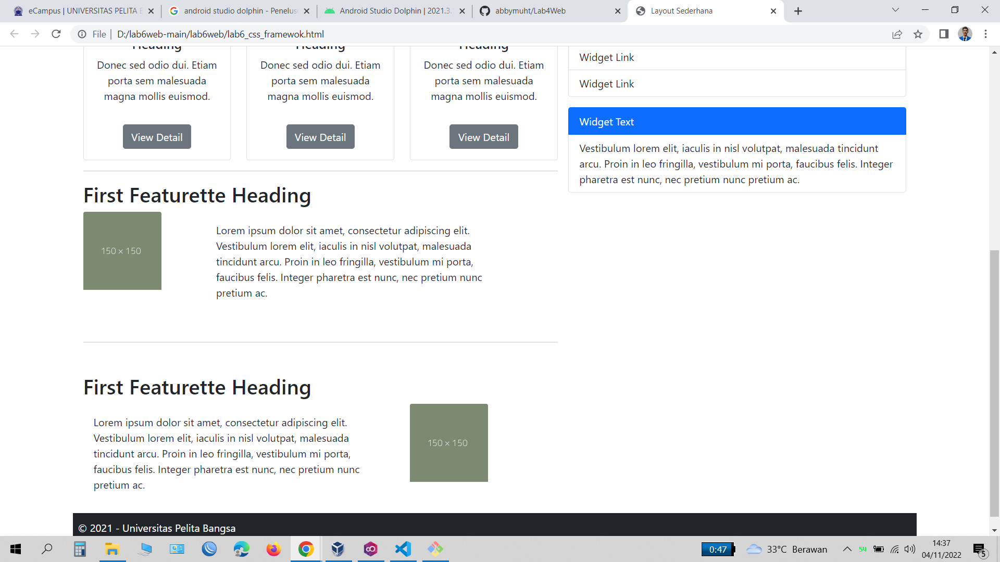

# Lab6Web CSS, Framework
# Nama      : Abby Muhammad Titan
# Nim       : 312110546
# Kelas     : TI.21.B.1
# UNIVERSITAS PELITA BANGSA
# Pertanyaan Dan Tugas
# Buatlah layout web sederhana menggunakan css framework (Twitter Bootsrtap).

# Buatlah folder baru dengan nama lab6_css_framework, kemudian buat dokumen baru html.
# Buka web https://getbootstrap.com, Karna Saya Disini Menggunakan Secara Online, Jadi Langsung Copy Framework pada web boostrap tersebut.
# Langkah-Langkah Membuat Dokumen HTML dengan tampilan javascript
# Langkah 1
# Proses 1
# Tampilan contoh java script

# Langkah 2
# Proses 2
# Memberi judul dengan layout sederhana, dan membuat layout menggunakan container

# Langkah 3
# Proses 3
# Pemakaian Navbar dengan framework yang ada pada bootstrap seperti gambar berikut:

# Langkah 4
# Proses 4
# Membuat hero panel, saya menggunakan wearna background sec dan opacity "25"

# Langkah 5
# Proses 5
# Menambahkan Element lain pada content, saya menggunakan col untuk membagi gambar perbagian masing-masing agar hasilnya tersusun

# Langkah 6
# Proses 6
# Menambahkan widget link

# Langkah 7
# Proses 7
# Dan terakhir menambahkan Footer.

# Cukup sekian saya Abby Muhammad Titan
# Terimakasih, Semoga Bermanfaat.
# Assalamualaikum